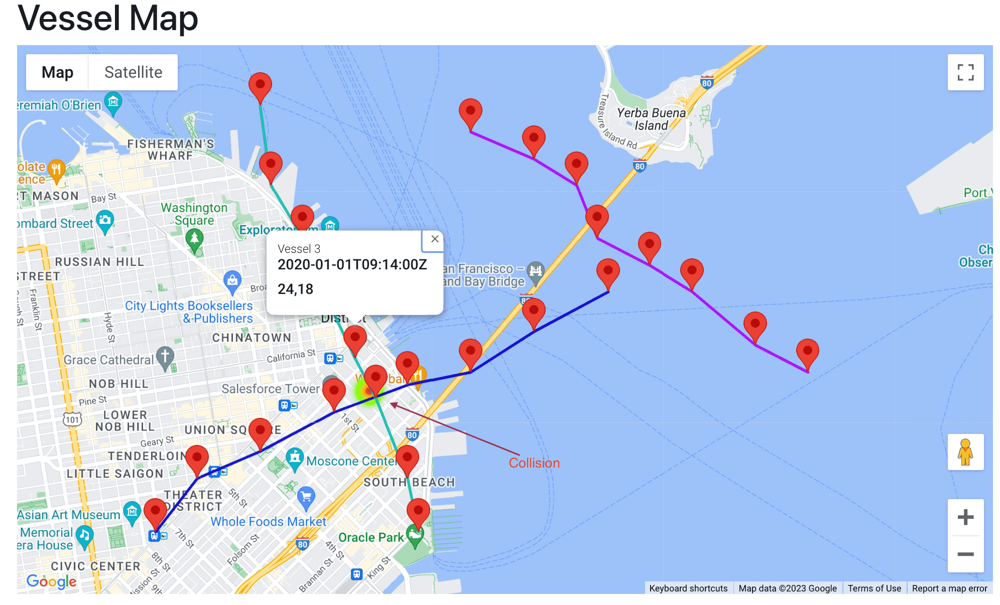

# Spring Boot + React - OneOcean Vessel

This project is an application for creating Vessel map/position using Java, Spring Boot, React and Google Maps API.

The Spring Boot API project files is located under the '/api' directory.
The React App project files are located under the '/react-app' directory.

## Getting Started

### Clone
To get started you can simply clone this repository using git:
```
git clone https://github.com/tuedang/spring-react-oneocean.git
```

### Run

**API**:

To start the Spring Boot API, launch a Terminal and run from the `api` root folder:

### `mvn spring-boot:run`

The API endpoint will be available on [http://localhost:8080/api](http://localhost:8080/api)

**Frontend**:

To run the React frontend app, run from the `react-app` root folder:

### `npm start` or `yarn start`

The app will be available on [http://localhost:3000](http://localhost:3000)

### Result on the map


